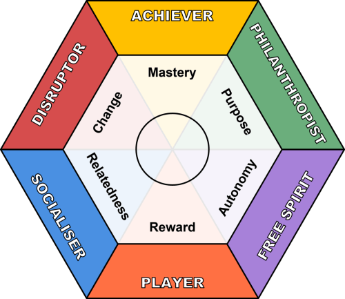
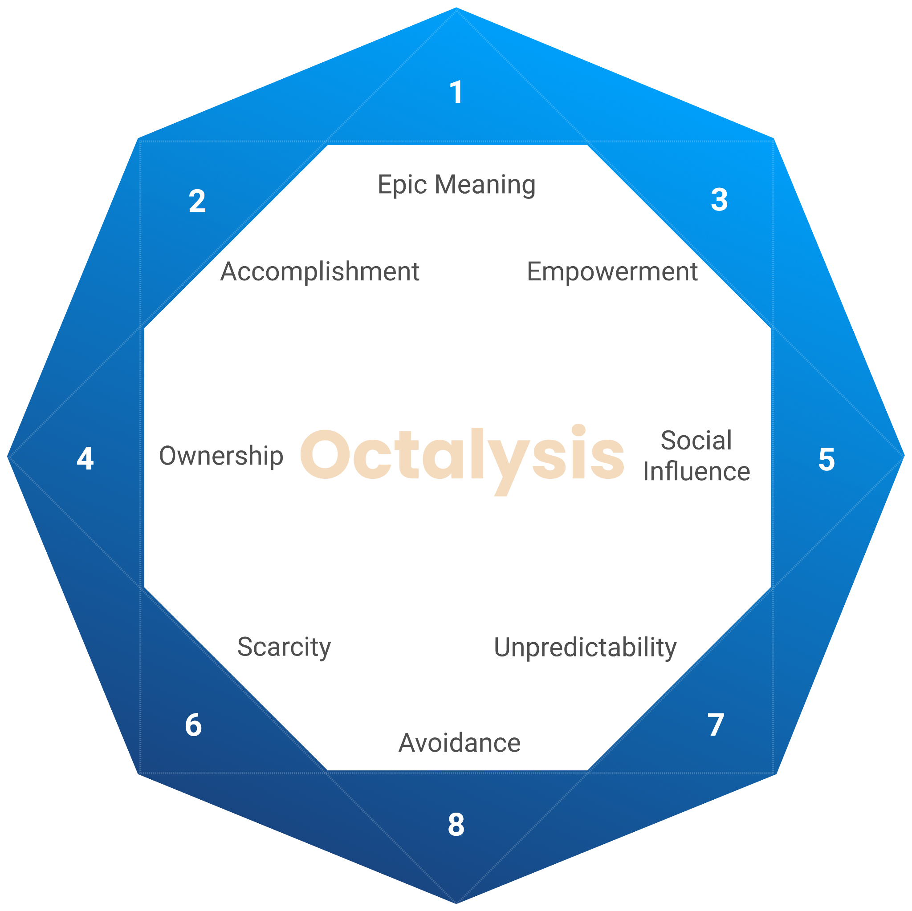
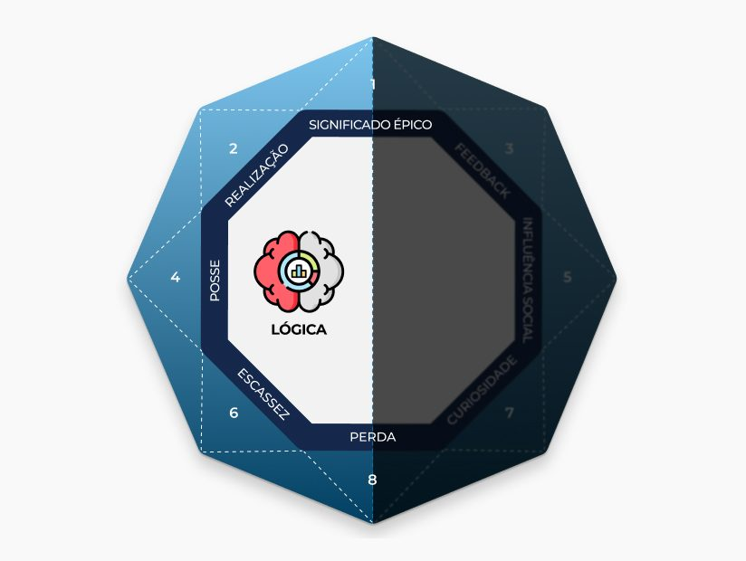
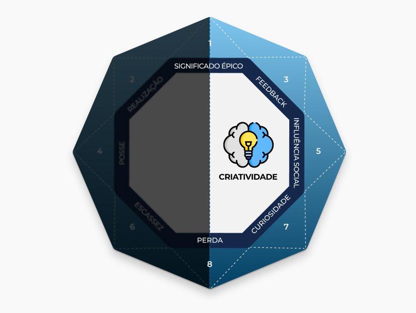
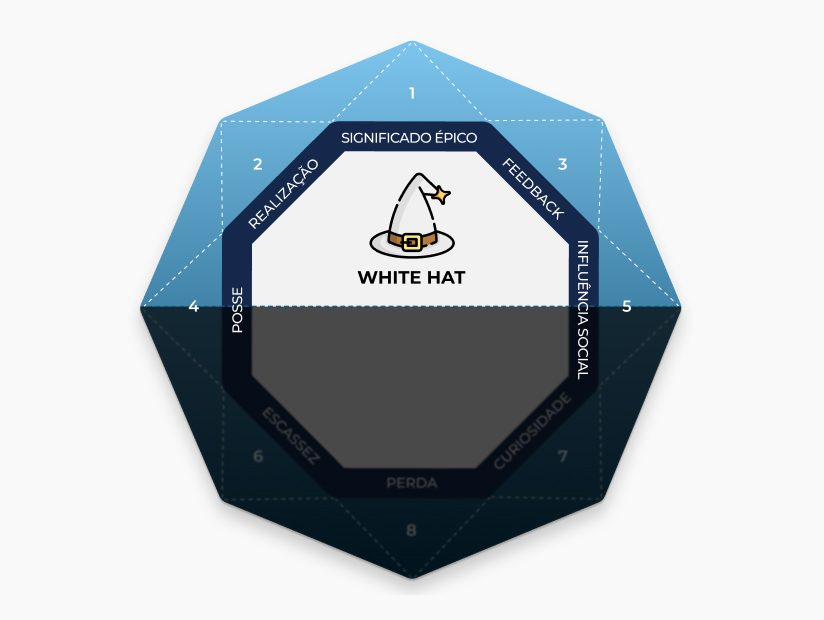
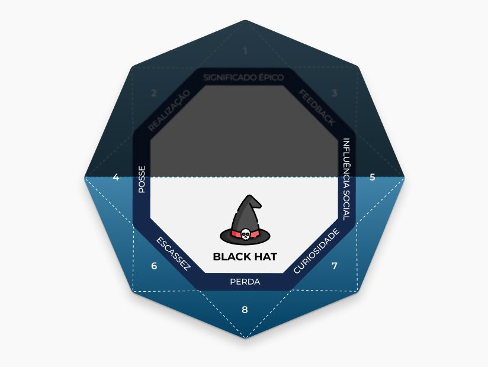

# Unidade III – Tipos de Jogadores e Psicologia

---

## 1. Visão Geral

Agora que você já possui um bom entendimento do contexto e do problema, é necessário entender as pessoas que estão nesse meio, afinal, a gamificação é feita para elas.

Nesta unidade, você irá aprender que cada pessoa reage de modo diferente a cada estímulo. Assim como um astro precisa conhecer seu público, você precisará conhecer seus jogadores para personalizar e adaptar a experiência de gamificação de acordo com as necessidades e motivações específicas deles. Compreender a psicologia por trás do engajamento evita que você crie um sistema que recompensa apenas um tipo de comportamento, frustrando o restante dos participantes.

---

## 2. Frameworks de Motivação & Perfis

### Gamification User Types Hexad

O modelo Hexad foi criado especificamente para o contexto da gamificação, utilizando pesquisas sobre motivação humana (como a [Teoria da Autodeterminação](https://pt.wikipedia.org/wiki/Teoria_da_autodetermina%C3%A7%C3%A3o)) para expressar motivações intrínsecas e extrínsecas. Em vez de se basear apenas em observações de comportamento, ele personifica o que motiva as pessoas. Ele classifica os usuários em seis tipos principais:

* **Filantropos:** São motivados por propósito e significado, sendo considerados altruístas. Preferem elementos de jogo que envolvam presentear (gifting), compartilhar conhecimento e assumir papéis administrativos.

* **Socializadores:** São motivados pela conexão e relacionamento. Seu engajamento é impulsionado pelo desejo de interagir com os outros, valorizando elementos como equipes (guildas), redes sociais e descoberta social.

* **Espíritos Livres:** São motivados por autonomia, buscando liberdade para se expressar e agir sem controle externo. Eles preferem tarefas exploratórias, customização, conteúdo desbloqueável e ferramentas de criatividade.

* **Empreendedores (Achievers):** São motivados por competência e buscam provar a si mesmos. Eles se engajam profundamente com desafios difíceis, missões, níveis de progressão e certificados.

* **Jogadores (Players):** São motivados essencialmente por recompensas extrínsecas. Para este perfil, o sistema deve focar fortemente em pontos, conquistas (achievements), placares de líderes (leaderboards) e recompensas tangíveis.

* **Disruptores:** São motivados pela mudança e tendem a testar os limites e fronteiras do sistema. Sentem-se atraídos por plataformas de inovação, mecânicas de votação e modos de jogo anárquicos.

!!! tip
    O uso do Hexad permite projetar sistemas personalizados selecionando os elementos de jogo corretos. No entanto, é importante lembrar que os indivíduos raramente são motivados por apenas um único perfil; a maioria possui uma tendência principal, mas também é motivada pelos outros tipos em diferentes graus.

### Framework Octalysis

Proposto por [Yu-kai Chou](https://en.wikipedia.org/wiki/Yu-kai_Chou), o Octalysis é focado em oito motivações humanas básicas (_Core Drivers_) que engajam os usuários a realizarem uma ação. O modelo em formato de octógono avalia as seguintes motivações: 

* **Significado Épico (Epic Meaning & Calling):** Ocorre quando o jogador acredita que está fazendo algo grandioso, atuando por um bem maior, ou sente que foi "escolhido" para realizar algo transcendental.

* **Desenvolvimento & Realização (Accomplishment & Development):** Acontece quando o jogador é motivado ao observar o seu próprio progresso, ao desenvolver novas habilidades e, por fim, ao superar os desafios propostos.

* **Empoderamento da Criatividade (Empowerment of Creativity & Feedback):** Surge quando o usuário é envolvido em um processo criativo onde ele precisa descobrir coisas repetidamente e testar diferentes combinações.

* **Propriedade & Posse (Ownership & Possession):** É o engajamento gerado quando o jogador é motivado pela sensação de ter a propriedade ou a posse de algo dentro do sistema.

* **Influência Social (Social Influence & Relatedness):** Acontece quando o jogador é motivado por elementos sociais que influenciam o comportamento das pessoas. Isso engloba orientação, aceitação, respostas sociais e companheirismo, mas também inclui sentimentos como competição e inveja.

* **Escassez & Impaciência (Scarcity & Impatience):** Ocorre quando o usuário é impulsionado pelo forte desejo de ter algo que ele simplesmente não pode possuir naquele momento.

* **Imprevisibilidade & Curiosidade (Unpredictability & Curiosity):** É a motivação gerada pela vontade contínua de descobrir o que vai acontecer em seguida. Como o jogador não sabe o resultado final, seu cérebro se envolve com a atividade e pensa sobre o assunto diversas vezes.

* **Prevenção de Perdas (Avoidance & Loss):** Surge quando o comportamento do jogador é impulsionado pela necessidade de prevenir que algo de negativo aconteça (como perder pontos, status ou perder o progresso já conquistado).

#### Divisão Horizontal

O modelo agrupa essas motivações de uma forma muito estratégica para o design:

* **Lado Direito (Motivações Intrínsecas):** Foca em criatividade, autoexpressão e aspectos sociais. Usuários motivados por esses fatores não precisam de um objetivo ou recompensa final para usar a criatividade ou interagir com amigos, o que torna esse lado excelente para produzir engajamento de longa duração.

* **Lado Esquerdo (Motivações Extrínsecas):** É mais associado a lógicas, cálculos e posse de bens. São motivações ótimas e claras para fazer o usuário iniciar um jogo ou atividade, porém, assim que o usuário atinge o objetivo ou ganha a recompensa, ele pode rapidamente perder o interesse.

  

!!! tip
    O Octalysis fornece uma maneira visual e prática de modelar os perfis dos estudantes ou colaboradores por meio de um gráfico de radar (ou aranha). Uma análise visual permite aos designers criarem um projeto que equilibre as motivações extrínsecas (para atrair os usuários no início) com as motivações intrínsecas (para manter o usuário recompensado e motivado a longo prazo)

#### Divisão Vertical

Além de mapear a lógica e a criatividade, o modelo Octalysis também divide os *Core Drivers* verticalmente, separando as motivações pela forma como fazem o usuário se sentir no dia a dia:

* **White Hat Gamification (Topo):** Representa as motivações "positivas", que estão localizadas na parte superior do octógono (Significado Épico, Realização e Empoderamento da Criatividade). Essas motivações fazem o usuário se sentir poderoso, no controle de suas escolhas e satisfeito com o próprio progresso. A única desvantagem é que elas não criam senso de urgência; o usuário engaja porque quer, mas no próprio tempo.

* **Black Hat Gamification (Base):** Representa as motivações "urgentes", que estão localizadas na parte inferior do modelo (Escassez, Imprevisibilidade e Prevenção de Perdas). Elas são ferramentas extremamente eficazes para gerar engajamento rápido e impulsionar ações imediatas, pois o usuário se sente curioso, impaciente ou com medo de perder uma oportunidade. O perigo do *Black Hat* é que, se usado em excesso, pode causar exaustão emocional e frustração, fazendo o usuário abandonar o sistema.

 

!!! tip
    Um bom projeto de gamificação não escolhe usar apenas um dos "chapéus". O ideal é que o designer consiga transitar estrategicamente entre mecânicas Black Hat (para gerar o impulso de ação e urgência inicial) e mecânicas White Hat (para reter o usuário, fazendo-o se sentir bem e empoderado a longo prazo).

---

## 3. Próximo Passo

Com o perfil dos seus jogadores mapeado e as principais motivações psicológicas compreendidas, avance para a **Unidade IV** para começar a colocar a mão na massa, definindo o tema, a narrativa e construindo a jornada interativa do seu sistema.
